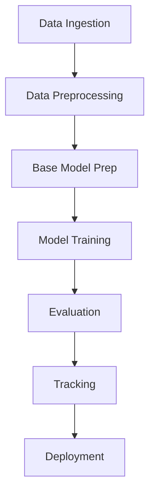

# Brain Tumor Classification using Deep Learning


## Table of Contents
- [Project Overview](#project-overview)
- [Architecture Diagram](#architecture-diagram)
- [Key Features](#key-features)
- [Dataset](#dataset)
- [Installation](#installation)
- [Configuration](#configuration)
- [Usage](#usage)
- [Code Examples](#code-examples)
- [MLOps Pipeline](#mlops-pipeline)
- [Results](#results)
- [Future Work](#future-work)
- [Contributing](#contributing)
- [License](#license)

## Project Overview
This project implements a robust deep learning solution for classifying brain tumors from MRI images into four categories using a modular, component-based architecture with MLOps best practices. The system leverages transfer learning with VGG16 and incorporates full CI/CD pipeline automation.

## Key Features
- **Modular Architecture**: Component-based design for easy maintenance and scalability
- **Transfer Learning**: Utilizes VGG16 with custom classification head
- **Data Pipeline**: Automated data ingestion and preprocessing
- **Model Training**: Configurable training pipeline with augmentation
- **Evaluation**: Comprehensive metrics tracking (accuracy, precision, recall, F1)
- **MLOps Integration**: DVC for data versioning and MLflow for experiment tracking
- **Reproducibility**: Full pipeline configuration via YAML files
- **Error Handling**: Comprehensive logging and exception handling

## Dataset
The dataset contains MRI images classified into 4 categories:
- Glioma
- Meningioma
- No tumor
- Pituitary tumor


## Installation

### Prerequisites
- Python 3.10
- Git
- DVC (for data versioning)
- MLflow (for experiment tracking)

### Setup Instructions
1. Clone the repository:
```bash
git clone https://github.com/shekhariitk/Brain-Tumor-detection-classification-project.git
cd brain-tumor-classificationDataset structure:
```

2. Create virtual environment:

```bash
python -m venv venv
On Windows: venv\Scripts\activate  #source venv/bin/activate 

```
3. Install dependencies:
``` bash
pip install -r requirements.txt

```
3. data version control(DVC):
``` bash
pip install dvc     # installation
dvc init            # initialisation
dvc repro           # reproduce

```

###  ` Workflows Of the projects`
- Update config.yaml
- Update secrets.yaml [Optional]
- Update params.yaml
- Update the entity
- Update the configuration manager in src config
- Update the components
- Update the pipeline
- Update the main.py
- Update the dvc.yaml
- app.py


## 🧩 Project Modules

### 1. `prepare_base_model.py`
- Creates a base CNN with Conv2D, MaxPooling, and Flatten layers.
- Adds fully connected (Dense) layers and compiles the model.
- Saves the base and updated model.

### 2. `training.py`
- Loads model from `updated_base_model_path`.
- Sets up training and test data generators.
- Handles augmentation, class weights, and training logic.
- Saves the final trained model.

### 3. `callbacks.py`
- Creates callbacks for EarlyStopping, ReduceLROnPlateau, and ModelCheckpoint.
- Computes class weights using `sklearn.utils.class_weight`.

### 4. `config_entity.py`
- Data classes for type-safe access to configuration values.

### 5. `configuration.py`
- Reads configuration and parameter values from `config.yaml` and `params.yaml`.

### 6. `logger.py`
- Centralized logging setup for tracking the pipeline.

---

## 📁 Folder Structure

- `src/` — Main source code
- `artifacts/` — Stores models and intermediate outputs
- `configs/` — Contains `config.yaml` and `params.yaml`
- `notebook/` — Jupyter notebook for experimentation
- `main.py` — Pipeline execution entry point
- `app.py` — (Optional) For deploying the model as a web service
- `README.md` — Documentation
- `requirements.txt` — Python dependencies

---

## ⚙️ Configuration Files

### `config.yaml`
Stores paths and structural settings.


# Brain Tumor Classification Pipeline

## Workflow Architecture



## Pipeline Architecture


